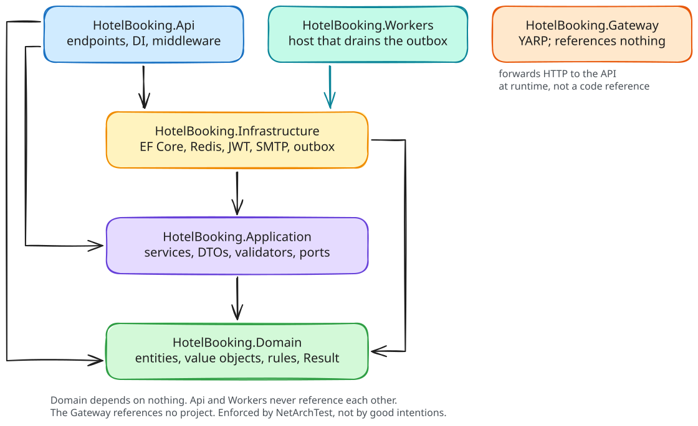
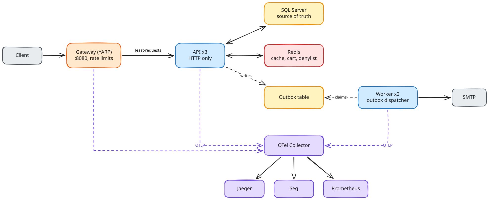
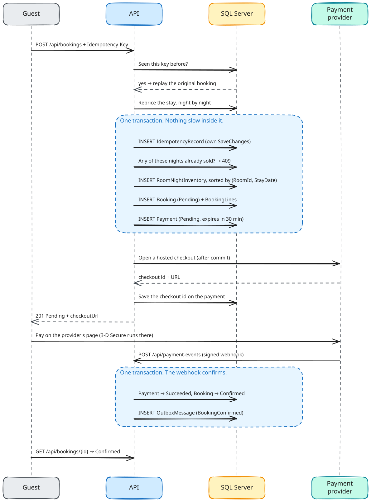
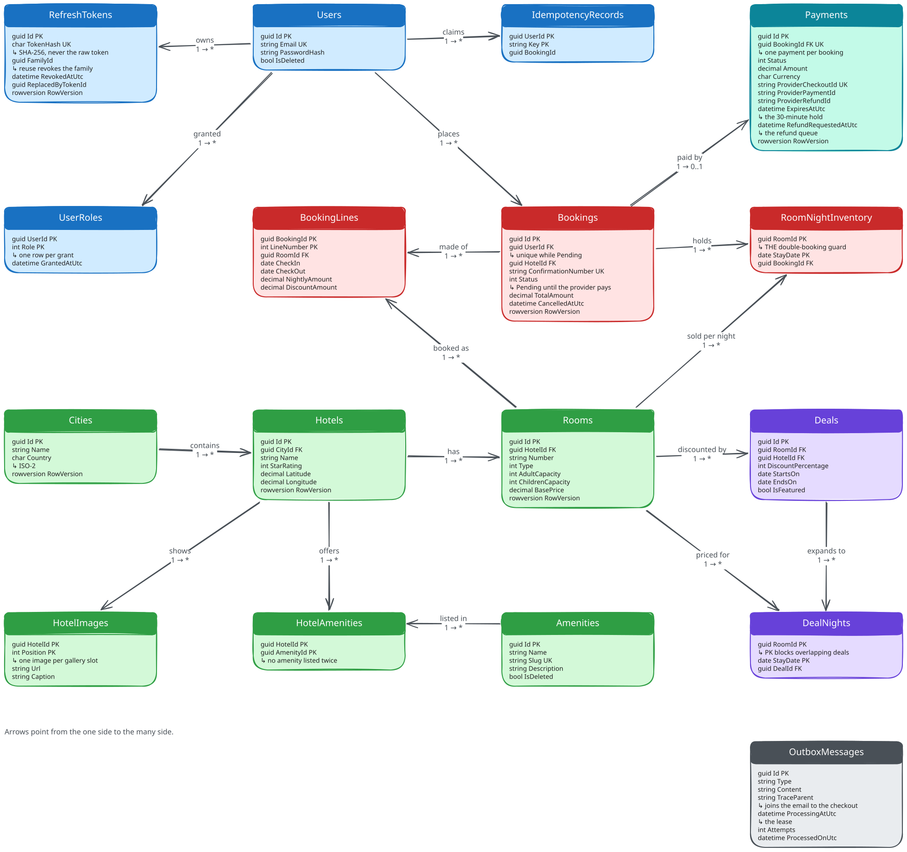
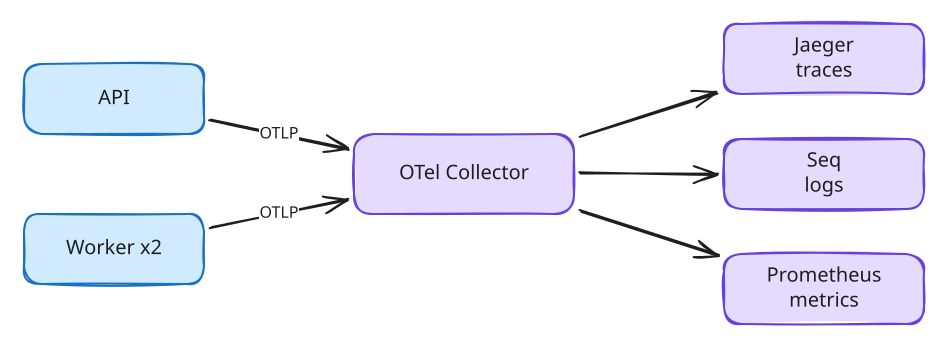

# Hotel Booking Platform — Backend

A REST backend for an online hotel booking platform. Guests search hotels, filter by dates and
price, fill a cart, check out, pay on the payment provider's hosted page, and get a confirmation
email. Admins manage cities, hotels, rooms and deals.

The goal was never "the endpoints return 200". It was one sentence:

> **A room-night is sold at most once, under concurrency.**

Everything below follows from that.

---

## Table of Contents

- [Technology Stack](#technology-stack)
- [Key Features](#key-features)
- [System Architecture](#system-architecture)
- [The Critical Path: Checkout](#the-critical-path-checkout)
- [Database Design](#database-design)
- [Indexes](#indexes)
- [Redis](#redis)
- [Design Decisions & Tradeoffs](#design-decisions--tradeoffs)
- [Getting Started](#getting-started)
- [API Reference](#api-reference)
- [Security](#security)
- [Reliability & Fault Tolerance](#reliability--fault-tolerance)
- [Observability](#observability)
- [Testing](#testing)
- [CI/CD](#cicd)
- [Project Structure](#project-structure)
- [What I Didn't Build](#what-i-didnt-build)

---

## Technology Stack

| Category | Technology |
| --- | --- |
| **Language** | C# 14 |
| **Runtime** | .NET 10 (LTS), nullable enabled, warnings-as-errors |
| **Web Framework** | ASP.NET Core Minimal APIs |
| **Database** | SQL Server 2025 |
| **ORM** | EF Core 10 |
| **Cache** | Redis 8 (StackExchange.Redis) |
| **Messaging** | Transactional Outbox in SQL Server — no broker |
| **Authentication** | JWT + rotating refresh tokens + Redis session denylist |
| **Password Hashing** | ASP.NET Core Identity (PBKDF2) |
| **Validation** | FluentValidation |
| **Email** | MailKit over SMTP |
| **Payments** | Stripe Checkout (Stripe.net), test mode only; a fake provider by default |
| **Logs / Traces / Metrics** | Serilog + OpenTelemetry → Collector → Seq / Jaeger / Prometheus |
| **Docs** | OpenAPI + Scalar |
| **Testing** | xunit.v3, Shouldly, NSubstitute, Testcontainers, NetArchTest |
| **Gateway** | YARP reverse proxy — least-requests, active + passive health checks, rate limiting |
| **Containerization** | Docker + Docker Compose |
| **CI/CD** | GitHub Actions |

---

## Key Features

| Feature | Description |
| --- | --- |
| **No double booking** | A room-night is a primary key. The database refuses the second buyer |
| **Idempotent checkout** | `Idempotency-Key` header; a replay returns the original booking, not a second one |
| **Hosted payment** | Checkout reserves the nights for 30 minutes and hands back the provider's payment page; card data never reaches the API |
| **Search & filters** | City, dates, guests, price range, stars, room type, sorted and paged |
| **Cart** | Redis-backed, 24h TTL, survives any instance dying |
| **Deals** | Night-by-night discounts, repriced server-side at checkout |
| **Home page discovery** | Featured deals, recently viewed hotels, trending cities |
| **Emails** | Welcome, confirmation and cancellation, each written in the transaction that caused it and delivered by the outbox |
| **Cancellation** | Guest-initiated inside a 48h window; releases the nights immediately and refunds a paid booking in full |
| **Unpaid bookings expire** | A booking not paid within 30 minutes expires and its nights go back on sale |
| **Rotating refresh tokens** | Hashed, with reuse detection that revokes the whole family |
| **RFC 9457 errors** | Every non-2xx is a problem document carrying a `traceId` and an `errorCode` |
| **Rate limiting** | At the gateway, fixed window per client IP; stricter on login and registration |
| **Horizontal scale** | Three API instances behind a YARP gateway; stop one and traffic moves to the others |
| **Full telemetry** | One trace id joins the HTTP request, the SQL, the cache and the email |

---

## System Architecture

Six projects. Dependencies point inward, and nothing points back out. Two of them are hosts — the
API serves HTTP, the worker drains the outbox and settles unfinished payments — and they never
reference each other. The sixth, the
gateway, sits in front of the API and references none of the others: it forwards bytes and has no
reason to know a database exists.



<sub>Source: [`readme-01-layers.excalidraw`](diagrams/readme-01-layers.excalidraw) — open it at excalidraw.com to edit.</sub>

The Domain depends on nothing — not even EF Core. It doesn't know a database exists. That rule is
enforced by NetArchTest assertions that fail the build, not by me remembering it.

Inside Domain and Application, folders are **aggregates** (`Bookings/`, `Hotels/`, `Deals/`), never
technical types. `Services/` + `Dtos/` + `Validators/` as top-level folders splits one feature
across three places, so every change touches all three. I've done that before. It's miserable.

### Runtime shape



<sub>Source: [`readme-02-runtime.excalidraw`](diagrams/readme-02-runtime.excalidraw) — open it at excalidraw.com to edit.</sub>

### Two read paths, on purpose

| Path | Used by | Returns | Why |
| --- | --- | --- | --- |
| **Repository** | writes | domain objects | Rules need real entities to enforce invariants |
| **Queries** (`IHotelQueries`) | list/search reads | DTOs, `AsNoTracking()` | Loading 20 hotels as tracked entities to render cards is waste |

Repositories never expose `IQueryable`. The moment they do, query logic leaks into services and the
repository can no longer be optimised or tested. Repositories also never call `SaveChanges` — that
belongs to `IUnitOfWork`, so **one use case is one transaction**.

### Stateless by design

| State | Where it lives | Consequence |
| --- | --- | --- |
| Identity | JWT, verified per request | No server-side session |
| Logout | Redis, keyed by session, self-expiring | Revocation is global and instant |
| Refresh tokens | SQL, hashed, rotating | Reuse detection survives a restart |
| Cart | Redis hash, 24h TTL | No sticky sessions needed |
| Payments in flight | SQL, each with its own expiry | Whichever worker runs next expires or refunds them |
| Recently viewed / trending | Redis sorted sets | Hot counters stay off the write path |
| Cached reads | Redis, with a DB fallback | Any instance benefits from any instance's fill |

No in-memory cache affects correctness and no local disk is on the request path. Kill any instance
mid-traffic and you lose only its in-flight requests.

### The gateway

Three API instances (`api-1`, `api-2`, `api-3`) sit behind a YARP gateway, which is the only one
of them with a published port.

| Concern | How |
| --- | --- |
| **Balancing** | Least-requests, no session affinity. Checkout holds a transaction and search can miss the cache, so work is uneven and round-robin would keep feeding a busy instance |
| **Active health** | Probes `/health/ready` every 5 s. An instance that loses SQL Server leaves rotation before a guest reaches it |
| **Passive health** | An instance whose connections start failing is taken out for 30 s without waiting for the next probe |
| **Rate limiting** | All of it, per client IP. One gateway sees every request, so the number in config is the real number, not three times it |
| **Correlation** | Every response returns the request's trace id as `X-Request-Id`; one id from gateway to SQL to the worker's email |

**The API trusts `X-Forwarded-For` from one address.** Compose pins the gateway to `172.30.0.250`,
and that single address is what the APIs believes.

If `ForwardedHeaders__GatewayAddress` is not set, the API reads no forwarded headers at all. That is
deliberate: with nothing to check a sender against, ASP.NET Core stops checking and believes every
caller, so "not configured" has to mean "not forwarded".

---

## The Critical Path: Checkout

This is the part worth reading carefully.



<sub>Source: [`readme-03-checkout.excalidraw`](diagrams/readme-03-checkout.excalidraw) — open it at excalidraw.com to edit.</sub>

Three things make this safe:

**1. Availability is not a boolean column.** It's derived from `RoomNightInventory`, primary key
`(RoomId, StayDate)` — one row per sold night. The primary key *is* the double-booking guard. I
don't check-then-act; I just insert, and the database refuses the loser. Correctness doesn't depend
on my code getting an ordering right.

**2. Inventory rows go in sorted by `(RoomId, StayDate)`.** Two overlapping multi-room checkouts
take their row locks in the same order, so one blocks instead of both deadlocking.

**3. Nothing slow runs inside the transaction.** Checkout reserves the nights and records a pending
payment, commits, and only then asks the payment provider for a hosted checkout page, because a
competing checkout for the same night blocks for exactly as long as that transaction stays open.

Unique violations are translated **by constraint name**:

| Constraint | Error | HTTP |
| --- | --- | --- |
| `PK_RoomNightInventory` | `Booking.RoomUnavailable` | 409 |
| `PK_IdempotencyRecords` | `Idempotency.RequestInProgress` | 409 |
| `IX_Bookings_UserId_Pending` | `Booking.PaymentPending` | 409 |

All three are 409, never a 500, and **never retried**. A sold room stays sold no matter how many
times you ask.

### Paying for It

Checkout ends with a **reserved** booking, not a confirmed one. The money moves on the provider's
page, and the provider tells the API what happened through a signed webhook.

| Step | Where | What happens |
| --- | --- | --- |
| **1. Reserve** | `POST /bookings`, one transaction | Booking `Pending`, its nights inserted, payment `Pending` with a 30-minute expiry |
| **2. Open checkout** | After commit | The provider creates a hosted checkout page; the `201` carries its `payment.checkoutUrl` |
| **3. Pay** | The provider's page | The guest pays there, 3-D Secure included. The API never sees a card number |
| **4. Confirm** | `POST /payment-events`, one transaction | Payment `Succeeded`, booking `Confirmed`, confirmation email written to the outbox |
| **5. Poll** | `GET /bookings/{id}` | The client learns the booking is `Confirmed` |

Every booking ends in a state, whichever way the guest leaves:

| Booking | Payment | How it got there |
| --- | --- | --- |
| `Confirmed` | `Succeeded` | Paid inside the 30 minutes |
| `Expired` | `Expired` | Never paid. The nights are released |
| `Cancelled` | `Expired` | Cancelled before paying. The provider's checkout is closed first |
| `Cancelled` | `Refunding` → `Refunded` | Cancelled after paying. The refund is sent by the worker |
| `Expired` | `Refunding` → `Refunded` | Paid **after** the hold ran out. The nights stay released and the money goes back |
| `Cancelled` or `Expired` | `RefundFailed` | The provider would not return the money. That pages someone |

A guest can hold **one** unpaid booking at a time. A filtered unique index on `Bookings (UserId)
WHERE Status = Pending` enforces it, so two checkouts in two tabs cannot hold twice the rooms.

---

## Database Design



<sub>Source: [`readme-04-database.excalidraw`](diagrams/readme-04-database.excalidraw) — open it at excalidraw.com to edit.</sub>

Six composite primary keys do real work here, and none of them are accidental:

| Key | What it prevents |
| --- | --- |
| `PK_RoomNightInventory (RoomId, StayDate)` | Two guests buying the same night |
| `PK_DealNights (RoomId, StayDate)` | Two deals discounting the same night |
| `PK_IdempotencyRecords (UserId, Key)` | A double-submitted checkout becoming two bookings |
| `PK_BookingLines (BookingId, LineNumber)` | A line existing without its booking |
| `PK_HotelImages (HotelId, Position)` | Two images claiming the same gallery slot |
| `PK_HotelAmenities (HotelId, AmenityId)` | A hotel listing the same amenity twice |

Payments live in their own table, one row per booking (`IX_Payments_BookingId` is unique). A row
holds the amount and currency asked for, the provider's checkout, payment and refund ids, when the
hold expires, and when the payment and any refund were resolved. It is its own aggregate, so a
booking never learns which provider took its money.

**Soft delete** is `IsDeleted` + a global query filter + **filtered indexes**. The filter means I
can't forget it; the filtered index means the index only carries rows anyone can actually see.

**Optimistic concurrency** on Cities, Hotels, Rooms, Deals, RefreshTokens, Bookings and Payments is
`rowversion`, mapped as an EF **shadow property** — the domain entity never grows a `byte[]` field to
satisfy the database. A stale admin edit gets a 409 explaining what happened. On Bookings and
Payments it is what stops a webhook and a cancellation both winning on the same booking.

---

## Indexes

Every query added in this project shipped with the index that serves it. 30 indexes besides the
primary keys, 20 of them filtered.

| Index | Columns | Filter | Serves |
| --- | --- | --- | --- |
| `IX_Rooms_HotelId_Capacity` | HotelId, AdultCapacity, ChildrenCapacity | not deleted | Search: rooms that fit the party *(includes BasePrice, Type)* |
| `IX_Rooms_HotelId_BasePrice` | HotelId, BasePrice | not deleted | "From" price per hotel card *(covering)* |
| `IX_Rooms_Type_BasePrice` | Type, BasePrice | not deleted | Room-type + price-range filters |
| `IX_Rooms_HotelId_Number` | HotelId, Number — **unique** | not deleted | No two rooms share a number in a hotel |
| `IX_Hotels_CityId_StarRating` | CityId, StarRating | not deleted | Search by city + stars *(includes Name, Thumbnail)* |
| `IX_Hotels_CityId_Name` | CityId, Name — **unique** | not deleted | No duplicate hotel name in a city |
| `IX_Hotels_Name` | Name | not deleted | Name sort and lookup |
| `IX_Cities_Country_Name` | Country, Name — **unique** | not deleted | No duplicate city per country |
| `IX_Cities_Name` | Name | not deleted | Admin city grid |
| `IX_Amenities_Slug` | Slug — **unique** | not deleted | No amenity catalogued twice |
| `IX_Deals_Live` | StartsOn, EndsOn | featured + not deleted | Home page featured deals *(includes RoomId, HotelId)* |
| `IX_Deals_RoomId_StartsOn_EndsOn` | RoomId, StartsOn, EndsOn | not deleted | Overlap check when a deal is written |
| `IX_Bookings_ConfirmationNumber` | ConfirmationNumber — **unique** | — | Confirmation lookup |
| `IX_Bookings_UserId_Pending` | UserId — **unique** | pending only | One unpaid booking per guest |
| `IX_Payments_BookingId` | BookingId — **unique** | — | One payment per booking, and loading it with the booking |
| `IX_Payments_ProviderCheckoutId` | ProviderCheckoutId — **unique** | has a checkout | Finding the payment a webhook names |
| `IX_Payments_Pending_ExpiresAtUtc` | ExpiresAtUtc | pending only | The unfinished payments worker finding overdue payments |
| `IX_Payments_Refunding_RefundRequestedAtUtc` | RefundRequestedAtUtc | refunding only | The unfinished payments worker finding refunds to send |
| `IX_Users_Email` | Email — **unique** | not deleted | Login, and one account per address |
| `IX_RefreshTokens_TokenHash` | TokenHash — **unique** | — | Refresh lookup by hash |
| `IX_RefreshTokens_FamilyId` | FamilyId | not revoked | Revoking a family on reuse |
| `IX_RefreshTokens_UserId` | UserId | not revoked | Ending every session when a role is revoked *(includes FamilyId)* |
| `IX_OutboxMessages_Unprocessed` | OccurredOnUtc | unprocessed only | The dispatcher's claim *(covering)* |

The other seven are foreign-key indexes for the joins:

| Index | Columns | Serves |
| --- | --- | --- |
| `IX_Bookings_UserId` | UserId | Bookings → Users |
| `IX_Bookings_HotelId` | HotelId | Bookings → Hotels |
| `IX_BookingLines_RoomId` | RoomId | BookingLines → Rooms |
| `IX_RoomNightInventory_BookingId` | BookingId | Releasing a booking's nights on cancel or expiry |
| `IX_Deals_HotelId` | HotelId | Deals → Hotels |
| `IX_DealNights_DealId` | DealId | Deals → their nights |
| `IX_HotelAmenities_AmenityId` | AmenityId | Amenities → the hotels that list them |

The outbox index is my favourite one. It's filtered on `ProcessedOnUtc IS NULL` and includes every
column the claim reads, so the dispatcher's query touches only the handful of rows still waiting —
even once the table holds a million processed messages. The two unfinished-payments indexes work
the same way: filtered on status, each holds only the payments still in flight, in the order the
worker takes them.

### Availability, as a query

Search excludes rooms already sold for the requested nights by checking the same table that
guards checkout (`HotelQueries.MatchingRooms`, `RoomQueries.Matching`):

```csharp
rooms.Where(room => !context.RoomNightInventory.Any(night =>
    night.RoomId == room.Id && night.StayDate >= checkIn && night.StayDate < checkOut));
```

EF translates this to a `NOT EXISTS` anti-join, so each room costs one seek on
`PK_RoomNightInventory (RoomId, StayDate)`.

One source of truth for availability, used by both the read path and the write path. They can't
disagree.

### Pagination

Offset paging: `page` starts at 1, `pageSize` is capped at **50**. Every sort breaks ties on the
id — without that, rows drift between pages and a guest sees the same hotel twice.

---

## Redis

Redis is a **cache, not a source of truth**. Every cached read has a database fallback, and the app
keeps serving if Redis is down. The cart is the one exception, and it's a deliberate one.

| Key | Type | TTL | Purpose | If Redis dies |
| --- | --- | --- | --- | --- |
| `hotel:{id}:details` | string | 5 min | Hotel detail page | Falls back to SQL |
| `hotels:search:{sha256}` | string | 90 s | Search results, keyed by a hash of every filter | Falls back to SQL |
| `deals:featured:{limit}` | string | 10 min | Home page deals | Falls back to SQL |
| `cart:{userId}` | Redis hash — a field → value map, one entry per cart item | 24 h | The guest's cart | **Cart endpoints return 503 `Cart.Unavailable`** until Redis is back |
| `auth:revoked-session:{id}` | string | token's remaining life | Logout denylist | Logged-out tokens work until they expire |
| `user:{id}:recent` | sorted set | 30 d | Last 5 hotels viewed | `GET /viewed-hotels` returns an empty list |
| `trending:cities:{date}` | sorted set | 8 d | One bucket per day | `GET /cities?sort=trending` returns 503 `City.TrendingUnavailable`; sorting by name still works |
| `trending:window:{date}` | sorted set | 60 s | 7 days unioned into a ranking | Same as above |

**Why the search key is a hash.** A search has twelve inputs — city, dates, guests, price bounds,
stars, room type, sort, page, page size. They are first written as one canonical string, in a fixed
order with the stars sorted, so the same search from two guests always produces the same string
and hits the same entry. That string is then SHA-256'd so every key is a fixed 64 characters,
however many filters are set, instead of a long key made from whatever the guest typed.

**Trending is a rolling window, not a counter.** A single `trending:cities` counter would be a
hall of fame — whatever was popular in March stays on top in December. Instead, each day gets its
own sorted set, and the ranking is the union of the last 7. Yesterday's spike ages out on its own,
with no cleanup job.

**The cart's honest cost.** It lives only in Redis, so a Redis flush empties every cart. I took
that trade because a cart is a convenience, not a commitment — nothing is paid for and nothing is
held. A SQL cart would mean a write on every "add to cart" and a cleanup job for carts nobody ever
checks out.

Every Redis failure is caught, counted on a metric, and degraded past. A cache that can take the
site down with it is worse than no cache.

---

## Design Decisions & Tradeoffs

### 1. There Is No Message Broker

**The challenge:** Checkout has to send a confirmation email. The email must not be lost if the
process dies, and must not be sent if the booking rolls back.

**The solution:** The outbox row is written **inside the checkout transaction**. A dispatcher in
the worker process claims rows with one atomic statement and hands them to a handler.

```sql
WITH candidates AS (
    SELECT TOP (@batchSize) Id, Type, Content, Attempts, ProcessingAtUtc, TraceParent
    FROM OutboxMessages WITH (READPAST, UPDLOCK, ROWLOCK)
    WHERE ProcessedOnUtc IS NULL
      AND Attempts < @maxAttempts
      AND (ProcessingAtUtc IS NULL
           OR ProcessingAtUtc < DATEADD(second, -@leaseSeconds, SYSUTCDATETIME()))
    ORDER BY OccurredOnUtc)
UPDATE candidates
SET ProcessingAtUtc = SYSUTCDATETIME(), Attempts = Attempts + 1
OUTPUT inserted.Id, inserted.Type, inserted.Content, inserted.Attempts, inserted.TraceParent;
```

RabbitMQ was in the plan. It was **built** — topology, publisher confirms, manual ack, a dedupe
table, a dead-letter queue — and then removed, because I couldn't answer one question: what does it
do that this table doesn't already do?

`ProcessingAtUtc` is the lease. `Attempts` against `MaxAttempts` is the dead-letter state. The
atomic claim is what makes N workers safe, and `READPAST` is what lets them skip each other's rows
instead of queueing behind them. The broker would have re-implemented all three in a
second system that can also be down.

**What I gained:**
- One delivery mechanism, one failure mode, one thing to operate
- The email can't be sent for a booking that rolled back — same transaction
- N worker instances drain the queue safely with no coordination
- The API does HTTP only. A slow mail server costs a worker thread, never a request thread

**What I traded:**
- **Two deployables.** The API and the worker are separate images, and with no worker running,
  confirmations wait in the table
- Polling latency: up to 5 seconds before a message is picked up
- No fan-out to other systems without writing that myself

The isolation a broker sells is kept in the code anyway: a handler implements
`IOutboxMessageHandler` and never learns how its message arrived. That is why moving dispatch out
of the API into its own process changed hosting code and not one line of a handler.

---

### 2. Emails Are At-Least-Once, Not Exactly-Once

**The challenge:** SMTP isn't part of the database transaction. "Sent" and "recorded as sent" can't
be made atomic.

**The solution:** Accept it. If the process dies after SMTP accepted the message but before the row
was marked processed, the lease expires, the row is claimed again, and the guest gets a second copy.

**What I gained:**
- No lost confirmations, ever — the failure mode is always "one too many", never "none"
- No distributed-transaction machinery, no two-phase commit, no provider-side protocol

**What I traded:**
- A rare duplicate email

That's the right way round. **A duplicate confirmation is mildly annoying; a missing one is a
support ticket and a guest at a front desk with no reservation.**

---

### 3. Expected Failures Are Values, Not Exceptions

**The challenge:** "Room unavailable" isn't a bug. Neither is "that city doesn't exist". Throwing
for outcomes the domain predicts means unwinding the stack for normal business flow and hoping
nothing catches it as a 500.

**The solution:** Every fallible operation returns `Result` / `Result<T>` with a typed `Error`
(`NotFound`, `Conflict`, `Validation`, `Forbidden`, `Failure`). Exceptions are for bugs and
infrastructure faults only. One mapping function turns an `Error` into a problem document.

**What I gained:**
- The signature tells you it can fail; you can't forget to handle it
- Every error reaches the client with the right status and a stable `errorCode`
- No `try/catch` as control flow

**What I traded:**
- More ceremony than `throw` — results have to be checked and propagated by hand

---

### 4. Refresh-Token Reuse Revokes the Whole Family

**The challenge:** A rotating refresh token that gets stolen is indistinguishable from a legitimate
one — until the real user tries to use the token the thief already spent.

**The solution:** Tokens are hashed at rest, rotate on every use, and carry a family id. Presenting
an already-revoked token means the token leaked, so the **entire family** is revoked.

**What I gained:**
- A stolen token buys the attacker one refresh before the family dies
- Detection is strict: **no grace window**, because a grace window is exactly the gap an attacker
  races into
- The raw token is never stored, so a database dump doesn't hand over sessions

**What I traded:**
- **The client must refresh single-flight.** Two parallel refreshes look exactly like a replay, and
  the second one revokes the family. That's a real constraint pushed onto callers

---

### 5. Cancellation Deletes Inventory, Immediately

**The challenge:** When a guest cancels, the nights have to go back on sale. If that happens
asynchronously, the room sits unsellable for as long as the queue is behind.

**The solution:** The cancellation transaction deletes the `RoomNightInventory` rows itself.

**What I gained:**
- The nights are purchasable again the instant the response returns
- One transaction: the booking is cancelled and the rooms are released, or neither happened

**What I traded:**
- Cancellation costs a few more row deletes inside the transaction
- Only bookings inside the **48-hour** window can be cancelled; past that it's a business decision,
  not a technical one

---

### 6. Reserve First, Pay on the Provider's Page

**The challenge:** Selling the nights and taking the money can't be one transaction — the provider
isn't in my database. And calling it *inside* the checkout transaction would hold the room-night
locks for as long as the provider takes to answer.

**The solution:** Checkout commits a `Pending` booking that holds its nights, plus a `Pending`
payment that expires in 30 minutes. Only then does it ask the provider for a hosted checkout page.
The provider reports the outcome through a signed webhook, and the webhook confirms the booking in
one transaction with the outbox row for its email. A worker closes whatever nobody finished.

Refunds use no outbox message. The payment row moving to `Refunding` *is* the durable request: the
worker sends every such row each minute until the provider answers, with an idempotency key per
payment, so the retry that follows a crash can't refund twice. It's the same reasoning as the
broker — the table already is the queue.

**What I gained:**
- The API never sees a card, and 3-D Secure is the provider's problem, not mine
- The checkout transaction stays as short as it was before payments existed
- Every path ends somewhere: paid → confirmed, unpaid → expired and released, paid late → refunded
- A webhook delivered twice changes nothing the second time; the payment is already in the state
  it asks for

**What I traded:**
- Nights are held up to 30 minutes for a guest who may never pay
- One unpaid booking per guest at a time
- Confirmation is asynchronous: the client polls `GET /bookings/{id}` after the guest comes back
- A refund the provider refuses can't be retried into success; it pages a human

---

## Getting Started

### Prerequisites

Docker and Docker Compose. Nothing else — no SQL Server, Redis, SMTP or .NET SDK on the host.

### Quick Start

```bash
# 1. Clone
git clone <repository-url>
cd Travel-and-Accommodation-Booking-Platform

# 2. Set the secrets
cp .env.example .env
echo "JWT_SIGNING_KEY=$(openssl rand -base64 48)" >> .env
echo "PAYMENT_WEBHOOK_SECRET=$(openssl rand -hex 32)" >> .env

# 3. Start everything
docker compose up -d --build
```

That's it. `api-1` applies the migrations at startup, seeds a demo catalogue (6 cities, 20 hotels,
80 rooms, 5 deals), and reports healthy. Then `api-2` and `api-3` start, the gateway starts once all
three are healthy, and two workers (`hotelbooking-worker-1` and `-2`) begin draining the outbox and
settling unfinished payments.

```bash
docker compose ps                                        # wait for hotelbooking-gateway to be healthy
curl -s http://localhost:8080/health/ready               # Healthy, answered by one of the three instances
```

### Try It

```bash
curl -X POST http://localhost:8080/api/users \
  -H 'Content-Type: application/json' \
  -d '{"email":"you@example.com","password":"Str0ng!Passw0rd","firstName":"Abdalkreem","lastName":"Bzoor"}'

TOKEN=$(curl -s -X POST http://localhost:8080/api/sessions \
  -H 'Content-Type: application/json' \
  -d '{"email":"you@example.com","password":"Str0ng!Passw0rd"}' | jq -r .accessToken)

curl -s "http://localhost:8080/api/hotels?page=1&pageSize=5" | jq
curl -s http://localhost:8080/api/cart -H "Authorization: Bearer $TOKEN" | jq
```

### Paying with Stripe (Test Mode)

Out of the box checkout pays through a **fake provider**, so nothing needs an account. To pay on
Stripe's real hosted page instead, with test cards:

```bash
# 1. Forward Stripe's events to the gateway; this prints the whsec_ secret it signs them with
stripe listen --forward-to localhost:8080/api/payment-events \
  --events checkout.session.completed,checkout.session.expired,refund.updated,refund.failed

# 2. In .env
PAYMENT_PROVIDER=Stripe
STRIPE_SECRET_KEY=sk_test_...        # dashboard.stripe.com/test/apikeys
STRIPE_WEBHOOK_SECRET=whsec_...      # printed by step 1

# 3. Restart the API instances and the workers
docker compose up -d api-1 api-2 api-3 worker
```

Check out, open the `payment.checkoutUrl` from the `201`, pay with `4242 4242 4242 4242` (any future
date, any CVC), and `GET /api/bookings/{id}` turns `Confirmed` within a second or two. A test card
that asks for 3-D Secure (`4000 0025 0000 3155`) works too, because Stripe runs that step on its
own page. Leave the page unpaid and the unfinished payments worker expires the booking after 30
minutes; cancel a paid booking and the refund shows in the Stripe dashboard.

The provider's own tests talk to Stripe only when a test key is present. Test projects build to
executables, so build first and run the one that holds them:

```bash
dotnet build tests/HotelBooking.Api.IntegrationTests
STRIPE_SECRET_KEY=sk_test_... tests/HotelBooking.Api.IntegrationTests/bin/Debug/net10.0/HotelBooking.Api.IntegrationTests -trait "Category=Stripe"
```

### Where Everything Is

| Service | URL | Notes |
| --- | --- | --- |
| **API (through the gateway)** | http://localhost:8080/api | All routes are under `/api`. The API instances publish no port |
| **Scalar API reference** | http://localhost:8080/scalar | Development only |
| **OpenAPI document** | http://localhost:8080/openapi/v1.json | Development only |
| **Mailpit** | http://localhost:8025 | Welcome, confirmation and cancellation emails land here |
| **Jaeger** | http://localhost:16686 | Traces |
| **Seq** | http://localhost:5341 | Logs |
| **Prometheus** | http://localhost:9090 | Metrics and alert rules |
| SQL Server | `localhost,1433` | user `sa` |
| Redis | `localhost:6379` | |

### Environment Configuration

| Variable | Purpose | Example |
| --- | --- | --- |
| `MSSQL_SA_PASSWORD` | SQL Server SA password | A strong password |
| `JWT_SIGNING_KEY` | HS256 signing key, **32+ bytes** | `openssl rand -base64 48` |
| `ConnectionStrings__Database` | SQL Server connection | Set by Compose |
| `ConnectionStrings__Redis` | Redis connection | `redis:6379` |
| `OTEL_EXPORTER_OTLP_ENDPOINT` | Where telemetry goes | `http://otel-collector:4317` |
| `ForwardedHeaders__GatewayAddress` | The one address whose `X-Forwarded-For` the API believes | `172.30.0.250` (the gateway) |
| `RateLimits__Auth__Permit` / `RateLimits__Global__Permit` | Gateway limits per client IP | `10` (per 15 min) / `300` (per min) |
| `Email__Smtp__Host` | SMTP host (worker only; the API sends no email) | `mailpit` |
| `PAYMENT_WEBHOOK_SECRET` | Signs events for the fake payment provider | `openssl rand -hex 32` |
| `PAYMENT_PROVIDER` | `Fake` (default) or `Stripe` | `Fake` |
| `STRIPE_SECRET_KEY` / `STRIPE_WEBHOOK_SECRET` | Stripe **test-mode** key and the `whsec_` secret from `stripe listen`; live keys are refused at startup | `sk_test_…` / `whsec_…` |

Secrets are never in `appsettings.json` — the committed file has empty placeholders so a missing
secret **fails loudly at startup** instead of quietly falling back to something insecure.

---

## API Reference

**37 routes**, one endpoint class per use case, all under `/api`.

Authorization is **deny-by-default**: a fallback policy requires an authenticated user, and each
public endpoint opts out explicitly. 13 routes are anonymous, 15 are admin-only, 9 need a signed-in
guest. One of the anonymous thirteen is the payment webhook, which is trusted only when the
provider's signature checks out.

### Users & Sessions

| Method | Route | Auth | Purpose |
| --- | --- | --- | --- |
| `POST` | `/users` | anonymous | Register |
| `POST` | `/sessions` | anonymous | Log in — returns access + refresh token |
| `PUT` | `/sessions/current` | anonymous | Rotate the refresh token |
| `DELETE` | `/sessions/current` | guest | Log out — denylists the session |
| `PUT` | `/users/{userId}/roles/{role}` | admin | Grant a role |
| `DELETE` | `/users/{userId}/roles/{role}` | admin | Revoke a role, ending every session of that user |

### Discovery

| Method | Route | Auth | Purpose |
| --- | --- | --- | --- |
| `GET` | `/hotels` | anonymous | **Search** — city, dates, guests, price, stars, type, sort, page |
| `GET` | `/hotels/{id}` | anonymous | Hotel details (counts towards trending) |
| `GET` | `/hotels/{id}/rooms` | anonymous | Rooms, with availability if a stay is given |
| `GET` | `/hotels/{id}/images` | anonymous | Gallery |
| `GET` | `/rooms/{id}` | anonymous | Room details |
| `GET` | `/cities` / `/cities/{id}` | anonymous | Cities |
| `GET` | `/deals` | anonymous | Featured deals |
| `GET` | `/amenities` | anonymous | Amenity catalogue |
| `GET` | `/viewed-hotels` | guest | Last 5 hotels this guest viewed |

### Cart & Booking

| Method | Route | Auth | Purpose |
| --- | --- | --- | --- |
| `GET` | `/cart` | guest | Read the cart |
| `POST` | `/cart/items` | guest | Add a stay |
| `DELETE` | `/cart/items/{itemId}` | guest | Remove one item |
| `DELETE` | `/cart` | guest | Empty the cart |
| `POST` | `/bookings` | guest | **Checkout** — reserves the nights and returns a hosted `checkoutUrl`; requires `Idempotency-Key` |
| `GET` | `/bookings/{id}` | guest | The booking and its payment — poll it after the guest pays |
| `POST` | `/bookings/{id}/cancellation` | guest | Cancel, releasing the nights and refunding a paid booking |
| `POST` | `/payment-events` | provider-signed | The payment provider's webhook |

### Admin

`POST` / `PUT` / `DELETE` on `/cities`, `/hotels`, `/rooms`, `/deals`, plus
`POST /hotels/{id}/rooms` and `GET /deals/{id}`. All admin-only, all `rowversion`-guarded.

### Errors

Every non-2xx is an RFC 9457 problem document, produced by exactly one mapping function:

```json
{
  "title": "Room unavailable",
  "status": 409,
  "detail": "One or more of the nights requested has already been booked.",
  "instance": "/api/bookings",
  "errorCode": "Booking.RoomUnavailable",
  "traceId": "6b85bea42af8c1c3919d28491e56cca7"
}
```

| `errorCode` prefix | Meaning | Status |
| --- | --- | --- |
| `*.NotFound` | No such record | 404 |
| `Booking.RoomUnavailable` | Those nights are sold | 409 |
| `Booking.PaymentPending` | The guest already has a booking waiting for payment | 409 |
| `Booking.PaymentJustCompleted` | Cancelled the moment the payment landed; cancel again once it's confirmed | 409 |
| `Payment.ProviderUnavailable` | The payment provider couldn't be reached; nothing was reserved or charged | 502 |
| `PaymentEvent.SignatureInvalid` | A webhook the provider didn't sign | 400 |
| `Idempotency.RequestInProgress` | Same key already in flight | 409 |
| `Persistence.ConcurrencyConflict` | `rowversion` mismatch — someone else edited it | 409 |
| `Booking.CancellationWindowClosed` | Past the 48h window | 409 |
| `Concurrency.VersionRequired` | Admin edit sent without `If-Match` | 428 |
| `Auth.*` | Credentials, tokens, sessions | 401 |
| `Request.TooManyRequests` | Rate limited by the gateway (`Retry-After` set) | 429 |
| `Gateway.UpstreamUnavailable` | No API instance could serve the request | 502 / 503 / 504 |

---

## Security

| Concern | How |
| --- | --- |
| **Passwords** | ASP.NET Core Identity hasher. Never logged |
| **Access token** | 15 minutes, carries `sub`, `jti`, `role`, `email`, `sid` |
| **Refresh token** | 7 days, rotating, SHA-256 stored, family reuse detection |
| **Logout** | Session id on a Redis denylist, TTL = the token's remaining life |
| **RBAC** | Policies (`AdminOnly`, `AuthenticatedUser`) |
| **Ownership** | "A guest reads only their own bookings" is checked in the service, not the endpoint |
| **Deny by default** | Fallback policy requires auth; public routes opt out one by one |
| **Rate limits** | At the gateway, per client IP. Auth (login + registration together): 10 / 15 min. Global: 300 / min. The payment webhook is exempt |
| **Card data** | Never reaches the API — the guest pays on the provider's hosted page |
| **Payment webhook** | Anonymous, but the raw body is trusted only with a valid `Stripe-Signature`; anything else is a 400 and changes nothing |
| **Stripe keys** | Test mode only. A live key is refused at startup |
| **Forwarded headers** | Believed only from the gateway's fixed address |
| **Request timeout** | 30 seconds, everywhere |

**The denylist keys the session, not the token.** Denylisting each `jti` means a logout only kills
the token you happened to be holding. Keying the session kills every token minted from that login
in one write.

Rate limits are counted **once, at the gateway**, so three API instances don't triple them. The
webhook route is the one exception: a throttled payment event is a guest's confirmation arriving
late, and the signature is what guards that route, not a request count.

---

## Reliability & Fault Tolerance

| Scenario | What happens |
| --- | --- |
| **Two guests buy the same night** | The `(RoomId, StayDate)` PK refuses one. 409, never a 500 |
| **Guest double-clicks checkout** | Idempotency PK catches it. Replay returns the original booking |
| **Process dies mid-checkout** | Transaction rolls back. No booking, no inventory, no email |
| **Process dies after commit** | Outbox row survives. A worker sends the email |
| **A worker dies mid-send** | Its lease expires and the other worker picks the row up |
| **No worker running** | Checkouts still succeed; confirmations wait and `outbox.pending` climbs |
| **Handler throws** | Lease expires, row is re-claimed, retried up to 5 times |
| **Handler fails 5 times** | Abandoned and counted on `outbox.abandoned` |
| **The payment provider is down** | The reserved booking expires and its nights are released; 502 |
| **Guest starts a second checkout before paying** | A filtered unique index refuses it. 409 |
| **The provider delivers a payment event twice** | The payment is already in the state the event asks for; the second is a 200 no-op, and no second email |
| **A paid booking is cancelled** | The payment moves to `Refunding` in the cancellation transaction; the unfinished payments worker sends every pending refund each minute until the provider answers, with an idempotency key per payment, so a retry never refunds twice |
| **An unpaid booking is cancelled** | The provider's checkout is closed first. If the guest paid in that same instant, 409 `Booking.PaymentJustCompleted` and the booking confirms instead |
| **The guest pays after the hold expired** | The late money is recorded and refunded in full; the released nights stay released |
| **The payment event never arrives** | The unfinished payments worker asks the provider to close the checkout, then expires it — or confirms it, if the guest paid at the last second |
| **A webhook and a cancellation touch one booking at once** | `rowversion` refuses the stale write; the webhook answers non-2xx and the provider delivers it again |
| **The provider refuses a refund** | `RefundFailed`, counted, and the `RefundFailed` alert pages |
| **Redis is down** | Cached reads fall back to SQL. Carts are unavailable. Site stays up |
| **SMTP is down** | Emails retry on the lease. The booking is unaffected |
| **Two admins edit one hotel** | `rowversion` mismatch → 409 explaining the stale write |

### Outbox Settings

| Setting | Value | Meaning |
| --- | --- | --- |
| Polling interval | 5 s | How often the dispatcher looks |
| Batch size | 20 | Rows claimed per cycle |
| Claim lease | 5 min | How long a claim holds before another worker may retry it |
| Max attempts | 5 | Then abandoned |

Handlers are **at-least-once** and signal failure by throwing. Background services live in
Infrastructure and are registered only by `AddWorkers`, which only `HotelBooking.Workers` calls.

### Unfinished Payments Settings

| Setting | Value | Meaning |
| --- | --- | --- |
| Hold | 30 min | How long a reserved booking waits for its payment |
| Interval | 1 min | How often the unfinished payments worker expires overdue payments, then sends pending refunds |
| Batch size | 50 | Payments, and refunds, handled per run |
| Provider timeout | 15 s | Per call to the provider, so a slow provider can't stall a run |

Both workers run it. The two can pick up the same payment, and `rowversion` lets only one of
them write.

---

## Observability

The app emits **OTLP and nothing else** — no Prometheus client library, no Jaeger SDK, no Seq sink.
Which backends sit behind the collector is a Compose concern, not a code one.



<sub>Source: [`readme-05-observability.excalidraw`](diagrams/readme-05-observability.excalidraw) — open it at excalidraw.com to edit.</sub>

### One Trace, Three Tools

Make a request, take its `X-Request-Id` (or the `traceId` of an error), and the same id finds it everywhere:

- **Jaeger** → `http://localhost:16686/trace/<traceId>`
- **Seq** → filter `@TraceId = '<traceId>'`

Traces cover ASP.NET Core, HttpClient, **SqlClient**, **Redis** and **SMTP** (MailKit), so one trace
shows the HTTP request, every query it ran, every cache call it made, every call to the payment
provider and the mail server it spoke to.

**The email joins the trace too.** The outbox row stores the `traceparent` of the checkout that
wrote it. When a worker picks it up seconds later, in another process, the email span attaches to
the original checkout — one trace across `hotelbooking-api` and `hotelbooking-worker`, from "guest
pressed book" to "mail server accepted".

### Metrics

Business metrics, not just RED:

| Metric | Why it matters |
| --- | --- |
| `bookings.created` / `bookings.duration` | The money path |
| `bookings.conflicts` | A rising conflict rate is a **business** signal — inventory is too thin |
| `idempotency.replays` / `idempotency.in_progress` | Clients double-submitting |
| `payments.started` / `payments.expired` | Checkouts handed to guests, and holds that ended without money (tagged by reason) |
| `payments.succeeded` / `payments.time_to_pay` | Money confirmed, and how long guests take to pay |
| `payments.refunds{status}` | Refunds requested, succeeded and **failed — money a guest is owed that the provider would not return** |
| `payments.events{outcome="unreconciled"}` | **Money taken that no booking holds and that could not be refunded automatically** |
| `outbox.pending` / `outbox.abandoned` | Queue depth, and promises not kept |
| `cache.hits` / `cache.misses` / `cache.unavailable` | Tagged by key prefix |
| `auth.refresh.reused` | Token replay detected |
| `deals.unpriceable` | Bad catalogue data reaching the home page |
| `http.ratelimit.rejected` | Who's being throttled, by gateway route |

### Alerts

Prometheus evaluates [`observability/alerts.yml`](observability/alerts.yml) every 30 seconds. The
two that page are the ones where a guest has been wronged in a way they can see and I can't:

| Alert | Severity | Fires when |
| --- | --- | --- |
| `RefundFailed` | page | The provider refused a refund. A guest is owed money that must go back by hand |
| `MoneyForNoBooking` | page | Money arrived that no booking holds and that couldn't be refunded automatically |
| `PaymentEventsFailing` | warn | More than 5 webhooks in 15 minutes failed to apply. Bookings are waiting to confirm |
| `OutboxMessagesAbandoned` | warn | An email ran out of attempts |

### Logs & Health

Structured JSON via Serilog, with the trace id on every line next to the real `ClientIp`. There is
no second request id: the trace id is it, returned on every response as `X-Request-Id`. The gateway's request log also records which instance
(`Upstream`) served the request.
Tokens, passwords and full email addresses are never logged.

| Probe | Checks |
| --- | --- |
| `/health/live` | The process is up |
| `/health/ready` | SQL Server and Redis are reachable |

Health endpoints are excluded from tracing — a probe every 10 seconds would drown the real traffic.

---

## Testing

121 tests across five suites. Each one proves something the others can't.

| Suite | Tests | Proves |
| --- | --- | --- |
| **Domain unit** | 37 | Invariants, value objects and the payment state machine. No mocks — pure functions in, `Result` out |
| **Application unit** | 28 | Orchestration: success, not-found, forbidden, conflict, validation |
| **Integration** | 31 | Real SQL Server + Redis via Testcontainers, over the real HTTP route. Two of them call Stripe's test mode and run only when a test key is set |
| **Architecture** | 23 | The dependency rule; Api and Workers never reference each other; the gateway references nothing; the API has no rate limiter |
| **Gateway** | 2 | The gateway returns the trace id as `X-Request-Id`, and never throttles the payment webhook |

The test I care about most fires **50 concurrent checkouts for the same room on the same nights**
and asserts exactly one 201, forty-nine 409s, no 5xx, that every loser got `Booking.RoomUnavailable`
specifically, and that the ledger ended up with exactly one row per night and one booking. It runs
**five times**, because a race that passes once has proved nothing. It's the only test that can
actually falsify the central claim of this project.

Others in that set: refresh-token rotation under a race, replay detection killing the whole
session, logout taking effect immediately (and being refused when the denylist is unreachable),
twenty parallel registrations with one email creating exactly one user, and a search traced through
both SQL and Redis.

The payment tests go after the same kind of claim: a completed checkout delivered twice confirms
the booking once and queues one email, an expiry arriving after the payment leaves the paid booking
alone, and the unfinished payments worker expiring a booking while its payment event arrives never
keeps money for nights the guest no longer holds.

### Load tests

Four k6 scenarios run against the full Docker stack, through the gateway and across all three API
instances. The contention run repeats the 50-caller race over a real network. The browse,
checkout and flood runs measure latency and throughput (flood sends 100k queries). Each one fails
the run when a threshold is crossed. How to run them: [`load/README.md`](load/README.md).

---

## CI/CD

### CI — every push to `main`/`develop`, every PR to `main`

| Step | What it does |
| --- | --- |
| **Restore** | With a NuGet cache keyed on `Directory.Packages.props` |
| **Format** | `dotnet format --verify-no-changes` |
| **Build** | Release, `-warnaserror` — zero warnings or it fails |
| **Unit tests** | Domain, Application, Architecture |
| **Integration tests** | Testcontainers against the runner's Docker daemon — real SQL Server and Redis |
| **Images** | Builds the API, worker and gateway images to prove every Dockerfile still works |

### CD — after CI goes green on `main`

Builds all three images and pushes them to **GitHub Container Registry**, tagged `latest` and the
commit SHA:

```
ghcr.io/<owner>/hotelbooking-api:latest      ghcr.io/<owner>/hotelbooking-worker:latest      ghcr.io/<owner>/hotelbooking-gateway:latest
ghcr.io/<owner>/hotelbooking-api:<sha>       ghcr.io/<owner>/hotelbooking-worker:<sha>       ghcr.io/<owner>/hotelbooking-gateway:<sha>
```

---

## Project Structure

```
src/
├── HotelBooking.Domain/           # depends on nothing
│   ├── Bookings/                  # Booking, BookingLine, RoomNight, pricing, IBookingRepository
│   ├── Payments/                  # Payment and its state machine, IPaymentRepository
│   ├── Hotels/  Rooms/  Cities/  Deals/  Carts/  Users/  RefreshTokens/
│   ├── Common/                    # Money, DateRange, Email, StarRating, Occupancy, GeoLocation
│   └── Results/                   # Result, Error, ErrorType
│
├── HotelBooking.Application/      # depends on Domain
│   ├── Bookings/                  # BookingService, BookingCancellationService, Dtos/, Validators/
│   ├── Payments/                  # PaymentService (webhooks, expiry), PaymentRefundService, IPaymentProvider
│   ├── Hotels/  Cities/  Deals/  Carts/  Rooms/  Visits/  Authentication/
│   ├── Abstractions/              # ICacheService, IEmailSender, IDateTimeProvider, ...
│   └── Telemetry.cs               # every metric, in one place
│
├── HotelBooking.Infrastructure/   # depends on Application + Domain
│   ├── Persistence/               # DbContext, Configurations/, Repositories/, Queries/, Migrations/
│   ├── Caching/                   # RedisCacheService, RedisCartRepository, RedisVisitStore
│   ├── Outbox/                    # dispatcher, store, handlers, the claim SQL
│   ├── Authentication/            # JWT, refresh tokens, denylist, password hashing
│   ├── Payments/                  # Stripe and fake providers, the unfinished payments worker
│   ├── Notifications/             # SMTP sender, email templates
│   ├── Observability/             # Serilog + OpenTelemetry setup shared by both hosts
│   └── DependencyInjection.cs     # AddInfrastructure, and AddWorkers for the worker host
│
├── HotelBooking.Api/              # HTTP only; composes, runs no background service
│   ├── Endpoints/                 # one class per use case, scanned and mapped
│   ├── Errors/                    # the single Error → ProblemDetails mapping
│   ├── Authentication/  Authorization/  Networking/  Observability/
│   ├── Dockerfile
│   └── Program.cs
│
├── HotelBooking.Workers/          # drains the outbox, settles unfinished payments; never references Api
│   ├── Dockerfile
│   └── Program.cs
│
└── HotelBooking.Gateway/          # YARP in front of api-1..3; references no other project
    ├── RateLimiting/              # the only rate limiter in the system
    ├── Forwarding/  Problems/  Observability/
    ├── appsettings.json           # routes, cluster, balancing, health checks
    ├── Dockerfile
    └── Program.cs

tests/
├── HotelBooking.Domain.UnitTests/
├── HotelBooking.Application.UnitTests/
├── HotelBooking.Api.IntegrationTests/     # Testcontainers: SQL Server + Redis
├── HotelBooking.Architecture.Tests/       # NetArchTest
└── HotelBooking.Gateway.IntegrationTests/ # request ids, and the webhook route never throttled

.github/workflows/    ci.yml, cd.yml
load/                 k6 load tests: contention, browse, checkout, flood
observability/        collector config, Prometheus config and alert rules
docker-compose.yml    gateway + 3 API instances + 2 workers + SQL Server + Redis + Mailpit + the telemetry pipeline
```

---

## What I Didn't Build

- **Live payments.** Stripe runs in test mode only, and a live key is refused at startup.
- **Partial refunds or cancellation fees.** A cancelled paid booking is refunded in full.
- **Grafana dashboards.**
- **Flushing trending counters to SQL.**
